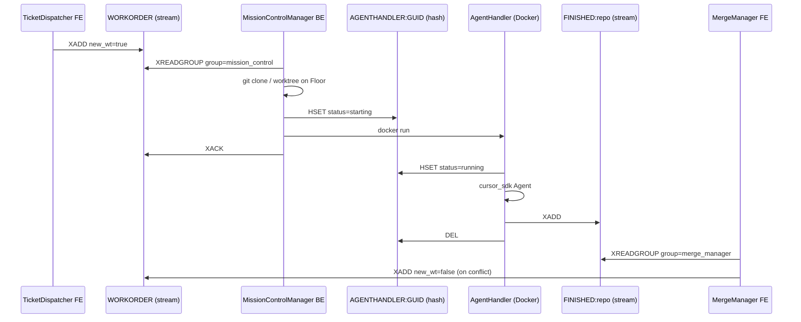

# Integration testing plan — agent-piloted GUI

Plan for giving agents a way to exercise MegaDesk end-to-end through the real GUI, so
that bugs at module interfaces get caught mechanically instead of by hand.

**Status:** proposal. No code written yet. The mechanism below was verified empirically
against the live canvas (DPG 2.3.1, Python 3.13.5); the two blockers in
[Blockers](#blockers-found-while-verifying) are real bugs found during that verification.

**Scope of the first slice:** the node-to-node workflow
`TicketDispatcher → MissionControl → MergeManager`.

Related: [`Docs/node_protocol.md`](node_protocol.md),
[`MegaDesk-contracts/redis/mission-control-pipeline.md`](../MegaDesk-contracts/redis/mission-control-pipeline.md).

---

## 1. The problem

Most observed breakage is not inside a module — it is at the seam between two of them:
a field renamed on one side of a Redis stream, a consumer group that never acks, a
widget callback that stops firing after a lifecycle change. Unit tests on either side
of a seam pass while the seam is broken.

The seams in this workflow are all crossed either by a **Redis stream** or by a **GUI
callback**, so a test that cannot press buttons cannot reach them.

---

## 2. Mechanism: how an agent pilots the GUI

Because the canvas and every FE run in **one Python process** (see
[`Docs/node_protocol.md`](node_protocol.md) — FEs are `dpg.node` items inside the canvas
`node_editor`, not separate processes or windows), an agent does not need OS-level input
injection or pixel matching. It drives the same code a click would.

Four capabilities, all confirmed working:

| Capability | API | Notes |
|---|---|---|
| Address any widget | `megadesk::{canvas_id}::{suffix}` | Deterministic via `hosted_node_tag()`; every FE derives suffixes from `tag_prefix` |
| Read / write widget state | `dpg.get_value` / `dpg.set_value` | |
| Fire the real handler | `dpg.get_item_callback(tag)` then call it | Returns the actual bound callback, so tests run production code, not a reimplementation |
| Advance time deliberately | `dpg.render_dearpygui_frame()` in a controlled loop | Replaces `while dpg.is_dearpygui_running()` |
| See the screen | `dpg.output_frame_buffer(path)` | Writes a PNG an agent can read back |

Verified end to end: booting the real canvas with an injected temp `canvas.json`,
simulating a Catalog drop of `ticket_dispatcher`, typing a repo URL, firing the input
callback, screenshotting, then firing the node's close button and asserting the member
was removed from the model. Full cycle in about 8 seconds.

### Viewport must be shown, not minimized

`show_viewport(minimized=True)` renders nothing — `output_frame_buffer` produced a
79-byte empty PNG. Positioning the viewport off-screen instead works and produced a
real 46 KB render:

```python
dpg.create_viewport(width=1280, height=800, x_pos=-2400, y_pos=0)
dpg.setup_dearpygui()
dpg.show_viewport()
```

**Consequence:** this needs a desktop session. It is not headless and will not run on a
bare SSH session or a standard hosted CI runner without a virtual display.

---

## 3. Blockers found while verifying

Both are in `frame_pump`, both must be fixed before any GUI test can pass, because the
harness drops nodes onto an empty board — precisely the trigger condition.

### 3.1 Pump arms at an absolute frame that may already be past

```22:31:MegaDesk-contracts/megadesk_contracts/frame_pump.py
    def _pump() -> None:
        for cb in list(_callbacks):
            try:
                cb()
            except Exception:
                pass
        if dpg.is_dearpygui_running():
            dpg.set_frame_callback(dpg.get_frame_count() + 1, _pump)

    dpg.set_frame_callback(1, _pump)
```

The re-arm line is relative; the initial arm is the literal frame `1`. If the first
registration happens after frame 1 has rendered, the callback is scheduled for a frame
in the past and never fires — but `_armed` flips to `True`, so the pump is permanently
dead for the session. Since `_armed` and `_callbacks` are module globals shared by every
FE, **no** node on the board gets its per-frame drain. Background threads keep filling
`_ui_queue` and nothing empties it.

Measured: registering before the first frame gives 30 ticks over 30 frames; registering
at frame 30 gives **0 ticks**, forever.

**Live impact, independent of testing:** start the canvas with an empty board, drop your
first node, and that node — plus every node dropped afterward — silently never updates.
It is masked today only because the committed `canvas.json` has three members, so
`open_all_megadesk_guis()` registers at frame 0 during startup.

**Fix:** arm relative, `dpg.set_frame_callback(dpg.get_frame_count() + 1, _pump)`,
matching the re-arm line.

### 3.2 Module state outlives the DPG context

Cycling `create_context()` / `destroy_context()` three times in one process: DPG itself
is fine (frames render, values read back), but `_armed` stays `True` and `_callbacks`
accumulates `1 → 2 → 3`. Cycles 2 and 3 get **0 pump ticks**, and stale callbacks from
destroyed contexts stay registered forever, silently swallowed by the bare `except`.

**Fix:** add a `frame_pump.reset()` that clears `_callbacks` and `_armed`, called on
context teardown. Without it, tests must use one process per test.

---

## 4. Workflow under test — the real contract map

All pipeline traffic is on **Redis DB 0**. Supervisor keys live on DB 1 and are not
involved here.



### Wire payloads to assert

`WORKORDER` — written by TicketDispatcher (`ticket_dispatcher_app.py:409`) and by
MergeManager's conflict path (`merge_manager_app.py:426`):

| Field | Dispatch value | Conflict value |
|---|---|---|
| `repo` | repo name from URL | `item.repo` |
| `URL` | `https://github.com/{owner}/{repo}` | `git remote get-url origin`, may be `""` |
| `new_wt` | `"true"` | `"false"` |
| `wt` | `""` | absolute ticket worktree path |
| `ticket_name` | GitHub issue title | `merge-{original}` |
| `instructions` | issue body, else title | merge instruction text |
| `model` | per-row combo (`auto` / `grok-4.5`) | `"auto"` |

`FINISHED:{repo}` — four fields, all strings: `ticket_name`, `ticket_id`, `wt`,
`agent_dir`. `wt` and `agent_dir` are **host-absolute** paths. Consumer group
`merge_manager`, created with `mkstream=False`.

Note the parsers accept aliases (`REPO`, `ticket`, `workpath`) but every writer emits
canonical names only. **Tests should assert the canonical wire format**, otherwise a
writer drifting to an alias would pass.

### Where to cut

The middle of the chain is not testable in a fast loop: `MissionControlManager` shells
out to `git clone --bare` and `docker run`, and `AgentHandler` calls the real Cursor API
via `cursor_sdk.Agent.create`. Requiring Docker, a network clone and an API key per test
run makes the suite slow and flaky, and none of it is the seam we are testing.

**Cut at the sandbox boundary.** A `FakeAgent` fixture replaces
`start_ticket_sandbox` + Docker + `cursor_sdk`: it consumes `WORKORDER` using the real
`mission_control` consumer group, makes a scripted commit in a real local ticket
worktree, and `XADD`s `FINISHED:{repo}`. Everything on both sides of it — the GUI, the
stream contracts, the consumer-group semantics, and the real `git merge` logic — stays
real.

The real MissionControl BE is never launched: with no Supervisor alive,
`DisplayEngine._maybe_launch_backend` logs and skips (`display_engine.py:136`), so
dropping `mission_control` in a test cannot spawn Docker.

---

## 5. Harness architecture

Proposed layout, mirroring the repo's convention that shared contracts live in
`MegaDesk-contracts`:

```text
MegaDesk-contracts/megadesk_contracts/testing/
  harness.py        # CanvasHarness: boot / pump / wait_until / drop / screenshot
  driver.py         # NodeDriver: tag-based read, write, click
  fakes.py          # FakeGh, FakeAgent
  gitfloor.py       # real local git Floor fixture
tests/
  conftest.py       # pytest fixtures wiring the above
  test_nodeflow.py  # the scenarios in section 6
```

### `CanvasHarness`

Boots the **real** canvas construction path with an isolated board and an off-screen
viewport, then exposes deliberate time control.

| Method | Behavior |
|---|---|
| `boot()` | `build_canvas(model)` with `CanvasModel(path=<tmp>)`, off-screen viewport, no Supervisor |
| `drop(node_name)` | Calls `engine.on_canvas_drop(NODE_EDITOR, f"megadesk:{name}", None)`, returns a `NodeDriver` |
| `pump(n)` | `engine.sync_megadesk_nodes()` + `render_dearpygui_frame()`, n times |
| `wait_until(pred, timeout)` | Pumps until predicate true or timeout; **raises** on timeout |
| `screenshot(path)` | `output_frame_buffer` + pump, for agent inspection and failure artifacts |
| `shutdown()` | `frame_pump.reset()` then `destroy_context()`; never calls `model.save()` |

`wait_until` is not optional sugar. Every FE in this chain updates through a background
thread → `_ui_queue` → frame-pump drain, so a fixed frame count is a race. During
verification a fixed-count pump produced an ambiguous result that could have been read
as "no bug" rather than the real pump failure.

### `NodeDriver`

Wraps one hosted node's `canvas_id` and resolves `megadesk::{cid}::{suffix}`.

```python
d = harness.drop("ticket_dispatcher")
d.set("git_url", "https://github.com/acme/widgets")
d.fire("git_url")                 # dpg.get_item_callback(...)(...)
harness.wait_until(lambda: d.get("status_text") != "Idle")
d.click(f"ticket_btn_{issue_id}")
```

`fire` and `click` go through `dpg.get_item_callback`, so a callback that gets unwired
by a refactor fails the test — which is the point. Reaching into module globals like
`ticket_dispatcher_app._LIVE` would keep passing and must be avoided.

### Fixtures

**`FakeGh`** — monkeypatches the module-level `ticket_dispatcher_app.run_gh` to return
canned `(ok, stdout, stderr)` for the two real invocations
(`gh repo view …`, `gh issue list --label agent-ready … --json number,title,body`).
No network, no GitHub auth, no rate limits. Requires no production change.

**`GitFloor`** — builds a **real** git Floor in a temp dir, because `merge.py` is worth
testing for real rather than stubbing six git argv patterns:

```text
<tmp>/origin.git              bare repo, serves as `origin`
<tmp>/Floor/<repo>/wt/agents  worktree on branch `agents`
<tmp>/Floor/<repo>/wt/tickets/<ticket>   worktree on branch `ticket/<name>`
```

A local bare `origin` matters: `attempt_merge` **always pushes on success**
(`merge.py:124`), so without a pushable origin the success path returns `ERROR` and the
test would assert the wrong thing. Helpers: `commit(worktree, path, text)` and
`make_conflict()`.

**`FakeAgent`** — the sandbox stand-in described in [section 4](#where-to-cut).

### Redis isolation

Tests must not run against the DB carrying real dev traffic, since assertions need a
known stream state and dismissal tests call `XDEL`. Point tests at a dedicated DB index
via `REDIS_URL` and flush it in fixture setup.

This is currently blocked on one node: **TicketDispatcher ignores `REDIS_URL`** and
hardcodes `localhost:6379` (`ticket_dispatcher_app.py:113`), so it cannot be redirected.
MergeManager and MissionControl already honor it, and
[`MegaDesk-contracts/redis/README.md`](../MegaDesk-contracts/redis/README.md) already
documents all three as using it — so this is also an existing doc/code mismatch.

---

## 6. Test scenarios

Ordered by seam. Each names the bug class it catches.

| # | Scenario | Catches |
|---|---|---|
| T1 | With `FakeGh` serving one issue, click the ticket row. Assert `WORKORDER` gained one entry with exactly the seven canonical fields, `new_wt="true"`, `wt=""`. | Field renames, legacy `WORKREQUEST`/`REPO` drift |
| T2 | Set the row's model combo to `grok-4.5`, then dispatch. Assert `model="grok-4.5"`. | Per-row widget → payload wiring |
| T3 | Dispatch, then let `FakeAgent` consume. Assert the `mission_control` group has zero pending after ack, and `FINISHED:{repo}` carries the four canonical fields with absolute paths. | Consumer-group and ack semantics; path relativization |
| T4 | `XADD FINISHED:{repo}`, pump. Assert row widgets `name::{repo}\|{id}` and `merge::{repo}\|{id}` exist and the merge button is visible. | Stream → GUI population; frame-pump drain |
| T5 | Real git, clean agents, non-conflicting ticket commit. Click `merge::{key}`. Assert `SUCCESS`, the commit is on `agents`, it landed in bare origin, and the row flips to MERGED (merge hidden, dismiss shown). | Merge + push path; row state machine |
| T6 | Craft conflicting commits. Click merge. Assert the merge was aborted (agents clean, no `MERGE_HEAD`) **and** a new `WORKORDER` exists with `new_wt="false"`, `wt=<abs ticket path>`, `ticket_name="merge-{orig}"`. | The loop-closing seam — highest value |
| T7 | Click `dismiss::{key}`. Assert `XACK` + `XDEL` on `FINISHED:{repo}` and the row widget is gone. | Stream cleanup vs GUI teardown |
| T8 | Full chain in one canvas with both FEs hosted: dispatch → `FakeAgent` → MergeManager row appears → merge → assert final git state. | Cross-node behavior over the **shared** frame pump |

T8 is the one that would have caught the `frame_pump` bug, and it is the only scenario
that exercises two FEs sharing pump state — the exact condition under which 3.1 and 3.2
manifest. A regression test asserting a node dropped at frame > 1 still receives pump
ticks should land alongside the fix.

Failure artifacts: on any assertion failure, call `screenshot()` and attach the PNG.
That is what lets an agent diagnose a GUI failure without a human watching.

---

## 7. Production changes required

Deliberately minimal. Only the first three are prerequisites.

| # | Change | Why | Risk |
|---|---|---|---|
| 1 | `frame_pump.register`: arm at `get_frame_count() + 1` | Blocker 3.1; also a live bug on an empty board | None — matches the existing re-arm line |
| 2 | Add `frame_pump.reset()`, call on teardown | Blocker 3.2; enables >1 canvas per process | None — new function |
| 3 | Split `main.py` into `build_canvas(model) -> DisplayEngine` + a `main()` that runs the loop | Today `main()` is one function with construction, Supervisor spawn and the blocking loop inline (`main.py:53-143`). Tests must not duplicate window construction or they drift and stop testing production. | Pure extraction, no behavior change |
| 4 | TicketDispatcher: honor `REDIS_URL` | Redis isolation; fixes an existing doc/code mismatch | Low — default unchanged |
| 5 | Tag the dispatch button, e.g. `tag=self._tag(f"ticket_btn_{ticket.id}")` (`ticket_dispatcher_app.py:363`) | It is currently untagged, so a test cannot address it by tag and would have to reach into `_LIVE`, defeating the point | None |
| 6 | Tag MergeManager's `testme` / `vscode` / `cursor` buttons | Same reason; not needed for T1–T8 | None |

---

## 8. Constraints and open questions

**Constraints**

- Needs a real desktop session. Off-screen viewport works; minimized does not render.
  CI requires a self-hosted runner with a session or a virtual display.
- One DPG context at a time per process, so canvas tests run serially, never with
  `pytest-xdist`.
- Requires a running Redis. `SupervisorClient` also hardcodes `localhost:6379`, though
  that only matters if Supervisor-facing tests are added later.
- `MergeManager._on_vscode` / `_on_cursor` use `Popen(..., shell=True)` on Windows and
  would launch real editors — do not fire those callbacks in tests.

**Open questions**

1. **Isolation strategy** — process-per-test (slow, ~5 s of DPG startup each, bulletproof)
   or one session-scoped canvas with board reset between tests (fast, relies on `reset()`
   in change 2 being complete)? Recommend starting session-scoped and falling back if
   leaks appear.
2. **Redis DB index for tests** — a spare index on the existing server, or a second
   server on another port? An index is simpler; a separate server is safer.
3. **Where the harness lives** — `MegaDesk-contracts/megadesk_contracts/testing/` ships
   it to every node (consistent with contracts being the shared installable), but adds a
   test-only surface to a runtime package. Alternative is a top-level `tests/` package
   not shipped to nodes.
4. **Scope of `FakeAgent`** — should it also assert `AGENTHANDLER:{guid}` hash
   transitions (`starting → running → DEL`), or is that a later slice?

---

## 9. Suggested order of work

1. Fix `frame_pump` (changes 1–2) plus a regression test for the frame > 1 case. Independently valuable — it is a live bug.
2. Extract `build_canvas` (change 3).
3. Land `CanvasHarness` + `NodeDriver` with one smoke test: drop a node, assert its widgets exist, close it, assert the model is empty. This is already proven to work.
4. Add `FakeGh` and `REDIS_URL` support (change 4), then T1–T2.
5. Add `GitFloor` and `FakeAgent`, then T3–T5.
6. Add T6–T8, the conflict feedback loop and the full chain.
