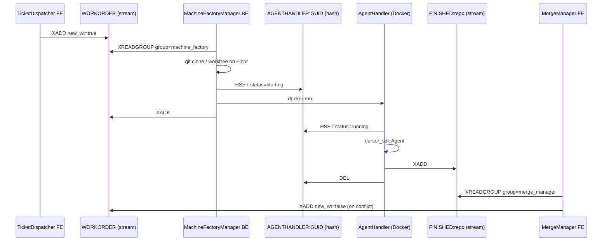

# Integration testing plan — agent-piloted GUI

Plan for giving agents a way to exercise MegaDesk end-to-end through the real GUI, so
that bugs at module interfaces get caught mechanically instead of by hand.

**Status:** implemented. The harness lives in
[`MegaDesk-contracts/megadesk_contracts/testing/`](../MegaDesk-contracts/megadesk_contracts/testing/)
and the suite in [`tests/`](../tests/); both blockers in
[Blockers](#blockers-found-while-verifying) are fixed. See
[Running the suite](#10-running-the-suite) for how to run it and
[What landed](#11-what-landed) for what changed against this plan.

**Scope of the first slice:** the node-to-node workflow
`TicketDispatcher → MachineFactory → MergeManager`.

Related: [`Docs/node_protocol.md`](node_protocol.md),
[`MegaDesk-contracts/redis/machine-factory-pipeline.md`](../MegaDesk-contracts/redis/machine-factory-pipeline.md).

---

## 1. The problem

Most observed breakage is not inside a module — it is at the seam between two of them:
a field renamed on one side of a Redis stream, a consumer group that never acks, a
widget callback that stops firing after a lifecycle change. Unit tests on either side
of a seam pass while the seam is broken.

The seams in this workflow are all crossed either by a **Redis stream** or by a **GUI
callback**, so a test that cannot press buttons cannot reach them.

---

## 2. Mechanism: how an agent pilots the GUI

Because the canvas and every FE run in **one Python process** (see
[`Docs/node_protocol.md`](node_protocol.md) — FEs are `dpg.node` items inside the canvas
`node_editor`, not separate processes or windows), an agent does not need OS-level input
injection or pixel matching. It drives the same code a click would.

Four capabilities, all confirmed working:

| Capability | API | Notes |
|---|---|---|
| Address any widget | `megadesk::{member_id}::{suffix}` | Deterministic via `hosted_node_tag()`; every FE derives suffixes from `tag_prefix` |
| Read / write widget state | `dpg.get_value` / `dpg.set_value` | |
| Fire the real handler | `dpg.get_item_callback(tag)` then call it | Returns the actual bound callback, so tests run production code, not a reimplementation |
| Advance time deliberately | `dpg.render_dearpygui_frame()` in a controlled loop | Replaces `while dpg.is_dearpygui_running()` |
| See the screen | `dpg.output_frame_buffer(path)` | Writes a PNG an agent can read back |

Verified end to end: booting the real canvas with an injected temp `graph.json`,
simulating a Catalog drop of `ticket_dispatcher`, typing a repo URL, firing the input
callback, screenshotting, then firing the node's close button and asserting the member
was removed from the model. Full cycle in about 8 seconds.

### Viewport must be shown, not minimized

`show_viewport(minimized=True)` renders nothing — `output_frame_buffer` produced a
79-byte empty PNG. Positioning the viewport off-screen instead works and produced a
real 46 KB render:

```python
dpg.create_viewport(width=1280, height=800, x_pos=-2400, y_pos=0)
dpg.setup_dearpygui()
dpg.show_viewport()
```

**Consequence:** this needs a desktop session. It is not headless and will not run on a
bare SSH session or a standard hosted CI runner without a virtual display.

---

## 3. Blockers found while verifying

Both are in `frame_pump`, both must be fixed before any GUI test can pass, because the
harness drops nodes onto an empty board — precisely the trigger condition.

**Both are now fixed, and both are covered.** Reintroducing either one fails 22 of the
38 tests, including every GUI scenario. Reverting 3.1 alone reports
`pump registered at frame 30 produced 0 ticks`; making `reset()` a no-op leaves every
test after the first with a dead pump. Regression coverage:
[`tests/test_frame_pump.py`](../tests/test_frame_pump.py) for the mechanism,
`test_first_node_on_an_empty_board_still_updates` in
[`tests/test_canvas_harness.py`](../tests/test_canvas_harness.py) for the live impact.

### 3.1 Pump arms at an absolute frame that may already be past

```22:31:MegaDesk-contracts/megadesk_contracts/frame_pump.py
    def _pump() -> None:
        for cb in list(_callbacks):
            try:
                cb()
            except Exception:
                pass
        if dpg.is_dearpygui_running():
            dpg.set_frame_callback(dpg.get_frame_count() + 1, _pump)

    dpg.set_frame_callback(1, _pump)
```

The re-arm line is relative; the initial arm is the literal frame `1`. If the first
registration happens after frame 1 has rendered, the callback is scheduled for a frame
in the past and never fires — but `_armed` flips to `True`, so the pump is permanently
dead for the session. Since `_armed` and `_callbacks` are module globals shared by every
FE, **no** node on the board gets its per-frame drain. Background threads keep filling
`_ui_queue` and nothing empties it.

Measured: registering before the first frame gives 30 ticks over 30 frames; registering
at frame 30 gives **0 ticks**, forever.

**Live impact, independent of testing:** start the canvas with an empty board, drop your
first node, and that node — plus every node dropped afterward — silently never updates.
It is masked today only because the committed `Graphs/default.json` has members, so
`host_all_members()` registers at frame 0 during startup.

**Fixed:** armed relative, `dpg.set_frame_callback(dpg.get_frame_count() + 1, _pump)`,
matching the re-arm line.

### 3.2 Module state outlives the DPG context

Cycling `create_context()` / `destroy_context()` three times in one process: DPG itself
is fine (frames render, values read back), but `_armed` stays `True` and `_callbacks`
accumulates `1 → 2 → 3`. Cycles 2 and 3 get **0 pump ticks**, and stale callbacks from
destroyed contexts stay registered forever, silently swallowed by the bare `except`.

**Fixed:** `frame_pump.reset()` clears `_callbacks` and `_armed`, and is called on
context teardown — by `main()` after the loop and by `CanvasHarness.shutdown()`. With it,
38 tests share one process and each gets a live pump.

---

## 4. Workflow under test — the real contract map

All pipeline traffic is on **Redis DB 0**. Supervisor keys live on DB 1 and are not
involved here.



### Wire payloads to assert

`WORKORDER` — written by TicketDispatcher (`ticket_dispatcher_app.py:409`) and by
MergeManager's conflict path (`merge_manager_app.py:426`):

| Field | Dispatch value | Conflict value |
|---|---|---|
| `repo` | repo name from URL | `item.repo` |
| `URL` | `https://github.com/{owner}/{repo}` | `git remote get-url origin`, may be `""` |
| `new_wt` | `"true"` | `"false"` |
| `wt` | `""` | absolute ticket worktree path |
| `ticket_name` | GitHub issue title | `merge-{original}` |
| `instructions` | issue body, else title | merge instruction text |
| `model` | per-row combo (`auto` / `grok-4.5`) | `"auto"` |

`FINISHED:{repo}` — four fields, all strings: `ticket_name`, `ticket_id`, `wt`,
`agent_dir`. `wt` and `agent_dir` are **host-absolute** paths. Consumer group
`merge_manager`, created with `mkstream=False`.

Note the parsers accept aliases (`REPO`, `ticket`, `workpath`) but every writer emits
canonical names only. **Tests should assert the canonical wire format**, otherwise a
writer drifting to an alias would pass.

### Where to cut

The middle of the chain is not testable in a fast loop: `MachineFactoryManager` shells
out to `git clone --bare` and `docker run`, and `AgentHandler` calls the real Cursor API
via `cursor_sdk.Agent.create`. Requiring Docker, a network clone and an API key per test
run makes the suite slow and flaky, and none of it is the seam we are testing.

**Cut at the sandbox boundary.** A `FakeAgent` fixture replaces
`start_ticket_sandbox` + Docker + `cursor_sdk`: it consumes `WORKORDER` using the real
`machine_factory` consumer group, makes a scripted commit in a real local ticket
worktree, and `XADD`s `FINISHED:{repo}`. Everything on both sides of it — the GUI, the
stream contracts, the consumer-group semantics, and the real `git merge` logic — stays
real.

The real MachineFactory BE is never launched: with no Supervisor alive,
`DisplayEngine._maybe_launch_backend` logs and skips (`display_engine.py:136`), so
dropping `machine_factory` in a test cannot spawn Docker.

---

## 5. Harness architecture

As built, mirroring the repo's convention that shared contracts live in
`MegaDesk-contracts`:

```text
MegaDesk-contracts/megadesk_contracts/testing/
  __init__.py           # the public surface: import everything from here
  harness.py            # CanvasHarness: boot / pump / wait_until / drop / screenshot
  driver.py             # NodeDriver: tag-based read, write, click
  fakes.py              # FakeGh, FakeAgent, FakeCodeAgent, FakeRealtime, the two factory fakes
  gitfloor.py           # real local git Floor fixture
tests/
  conftest.py           # fixtures, sys.path order, canonical field sets
  test_frame_pump.py    # the two blockers in section 3
  test_canvas_harness.py# the harness reaches production code
  test_nodeflow.py      # the scenarios in section 6
  test_vertical_slice.py# TicketDispatcher → MachineFactory → MergeManager on SMOKETESTREPO
  test_node_runtime.py  # heartbeat, kill switch, stale RUNNINGNODES
  test_wire_contract.py # the WORKORDER / FINISHED wire format
  test_machinefactory_flow.py # the order loop and the sandbox reaper
  test_cloudfactory_flow.py   # the same three verbs against the cloud
```

`megadesk_contracts.testing` imports nothing from any node — the node-specific pieces
(the module whose `run_gh` to patch, the wire helpers to build payloads with) are
injected by `conftest`. Otherwise a shared runtime package would depend on the nodes
that depend on it.

### `CanvasHarness`

Boots the **real** canvas construction path with an isolated board and an off-screen
viewport, then exposes deliberate time control.

| Method | Behavior |
|---|---|
| `boot()` | `build_canvas(model)` with `GraphModel(path=<tmp>)`, off-screen viewport, no Supervisor panel |
| `drop(node_name, position="auto")` | Calls `engine.on_graph_drop(NODE_EDITOR, f"megadesk:{name}", None)`, returns a `NodeDriver`. `position` defaults to a grid slot so screenshots do not stack nodes; `None` keeps what the drop computed from the mouse |
| `pump(n)` | `engine.sync_members()` + `render_dearpygui_frame()`, n times |
| `wait_until(pred, timeout=10)` | Pumps until predicate true or timeout; **raises** `HarnessTimeout` with a screenshot path |
| `wait_for_widget` / `wait_for_value` | `wait_until` with a message naming the widget |
| `screenshot(name)` | `output_frame_buffer` + pump, into the per-test artifacts directory |
| `install_pump_probe()` | Registers a tick counter on the shared pump |
| `clear_board()` | Deletes every member, running each FE's cleanup |
| `shutdown()` | `clear_board()`, then `frame_pump.reset()`, then `destroy_context()` |

`shutdown` clears the board before destroying the context so each FE's cleanup callable
runs and its polling thread stops. Skipping that leaks a thread per test.

`wait_until` is not optional sugar. Every FE in this chain updates through a background
thread → `_ui_queue` → frame-pump drain, so a fixed frame count is a race. During
verification a fixed-count pump produced an ambiguous result that could have been read
as "no bug" rather than the real pump failure.

### `NodeDriver`

Wraps one hosted node's `member_id` and resolves `megadesk::{cid}::{suffix}`.

```python
d = harness.drop("ticket_dispatcher")
d.type_into("git_url", "https://github.com/acme/widgets")   # set + fire
harness.wait_for_widget(d, f"ticket_btn_{issue_id}")
d.select(f"ticket_model_{issue_id}", "grok-4.5")
d.click(f"ticket_btn_{issue_id}")
```

`fire` and `click` go through `dpg.get_item_callback`, so a callback that gets unwired
by a refactor fails the test — which is the point. Reaching into module globals like
`ticket_dispatcher_app._LIVE` would keep passing and must be avoided.

Callbacks are invoked with as many of `(sender, app_data, user_data)` as their signature
accepts, matching what Dear PyGui does — FEs legitimately bind zero-argument lambdas
next to three-argument methods.

Other members: `get` / `set` / `label` / `user_data`, `shown` and `enabled` (read the
configured flag, not `is_item_visible`, which also depends on scroll position),
`exists`, `close()` for the host node's **x**, and `suffixes(pattern)` to discover
dynamically keyed row widgets — which is also what a "missing widget" failure prints.

### Fixtures

**`FakeGh`** — monkeypatches the module-level `ticket_dispatcher_app.run_gh` to return
canned `(ok, stdout, stderr)` for the two real invocations
(`gh repo view …`, `gh issue list --label agent-ready … --json number,title,body`).
No network, no GitHub auth, no rate limits. Requires no production change.

**`GitFloor`** — builds a **real** git Floor in a temp dir, because `merge.py` is worth
testing for real rather than stubbing six git argv patterns:

```text
<tmp>/origin.git              bare repo, serves as `origin`
<tmp>/Floor/<repo>/.bare      bare clone of origin
<tmp>/Floor/<repo>/wt/dev     worktree on branch `dev`
<tmp>/Floor/<repo>/wt/agents  worktree on branch `agents`
<tmp>/Floor/<repo>/wt/tickets/<ticket>   worktree on branch `ticket/<name>`
```

A local bare `origin` matters: `attempt_merge` **always pushes on success**
(`merge.py:124`), so without a pushable origin the success path returns `ERROR` and the
test would assert the wrong thing. Helpers: `add_ticket`, `commit(worktree, path, text)`,
`dirty`, `make_conflict`, and read-only `head` / `origin_sha` / `is_clean` /
`merge_in_progress` / `contains` / `subjects`.

`make_conflict` requires the ticket worktree to exist already. Branching a ticket *after*
the agents commit would fast-forward cleanly instead of conflicting, which would quietly
turn T6 into a second copy of T5.

**`FakeAgent`** — the sandbox stand-in described in [section 4](#where-to-cut). It
consumes through the real `machine_factory` group, honors `new_wt` (creating a ticket
worktree, or reusing the absolute `wt` a conflict WORKORDER carries), commits for real,
and builds its FINISHED payload with MachineFactory's own `finished_fields`.

### Redis isolation

Tests must not run against the DB carrying real dev traffic, since assertions need a
known stream state and dismissal tests call `XDEL`. Tests point at **DB 15** via
`REDIS_URL`, set in `conftest` before any node is imported, and flush it around every
test. The `redis_client` fixture refuses to flush any other index.

Every production Redis client (TicketDispatcher, MergeManager, MachineFactory,
`SupervisorClient`, Supervisor provision) honors `REDIS_URL` via
`redis.Redis.from_url` / `resolve_redis_url()`.

---

## 6. Test scenarios

Ordered by seam. Each names the bug class it catches.

| # | Scenario | Catches |
|---|---|---|
| T1 | With `FakeGh` serving one issue, click the ticket row. Assert `WORKORDER` gained one entry with exactly the seven canonical fields, `new_wt="true"`, `wt=""`. | Field renames, legacy `WORKREQUEST`/`REPO` drift |
| T2 | Set the row's model combo to `grok-4.5`, then dispatch. Assert `model="grok-4.5"`. | Per-row widget → payload wiring |
| T3 | Dispatch, then let `FakeAgent` consume. Assert the `machine_factory` group has zero pending after ack, and `FINISHED:{repo}` carries the four canonical fields with absolute paths. | Consumer-group and ack semantics; path relativization |
| T4 | `XADD FINISHED:{repo}`, pump. Assert row widgets `name::{repo}\|{id}` and `merge::{repo}\|{id}` exist and the merge button is visible. | Stream → GUI population; frame-pump drain |
| T5 | Real git, clean agents, non-conflicting ticket commit. Click `merge::{key}`. Assert `SUCCESS`, the commit is on `agents`, it landed in bare origin, and the row flips to MERGED (merge hidden, dismiss shown). | Merge + push path; row state machine |
| T6 | Craft conflicting commits. Click merge. Assert the merge was aborted (agents clean, no `MERGE_HEAD`) **and** a new `WORKORDER` exists with `new_wt="false"`, `wt=<abs ticket path>`, `ticket_name="merge-{orig}"`. | The loop-closing seam — highest value |
| T7 | Click `dismiss::{key}`. Assert `XACK` + `XDEL` on `FINISHED:{repo}` and the row widget is gone. | Stream cleanup vs GUI teardown |
| T8 | Full chain in one canvas with both FEs hosted: dispatch → `FakeAgent` → MergeManager row appears → merge → assert final git state. | Cross-node behavior over the **shared** frame pump |
| V1 | TicketDispatcher on `https://github.com/SamJBoyer/SMOKETESTREPO.git` → MachineFactory FE shows a live `AGENTHANDLER` → FakeAgent finishes → MergeManager merges. | The sandbox row T8 never hosted |

T8 is the one that would have caught the `frame_pump` bug, and it is the only scenario
that exercises two FEs sharing pump state — the exact condition under which 3.1 and 3.2
manifest. The regression test asserting a node dropped at frame > 1 still receives pump
ticks landed alongside the fix, as
`test_first_node_on_an_empty_board_still_updates`.

All eight are implemented in [`tests/test_nodeflow.py`](../tests/test_nodeflow.py), with
these added while building them:

| # | Scenario | Catches |
|---|---|---|
| T1b | An issue with an empty body dispatches with `instructions` = its title. | The body/title fallback silently inverting |
| T2b | With `gh repo view` failing, the error text reaches `status_text` and no ticket row appears. | Errors swallowed instead of surfaced |
| T3b | A second `FakeAgent` pass returns nothing and adds no second FINISHED entry. | Redelivery of acked entries |
| T4b | A FINISHED entry missing fields is acked and never rendered. | Poison entries retried forever, or rendered half-built |
| T5b | Dirty agents: merge is refused, `hard-reset` appears, and merging after reset succeeds. | The DIRTY branch of the row state machine |
| T6b | `FakeAgent` consumes the conflict WORKORDER and reuses the existing worktree. | A follow-up WORKORDER its own consumer would reject |

Failure artifacts: `wait_until` writes a screenshot on timeout and puts the path in the
error, into `tests/_artifacts/<test name>/`. That is what lets an agent diagnose a GUI
failure without a human watching — a dead pump, for instance, shows up as a dispatcher
still reading `Idle` with a grey connection light.

---

## 7. Production changes made

Deliberately minimal — all six landed, none changes production behavior.

| # | Change | Why | Risk |
|---|---|---|---|
| 1 | `frame_pump.register`: arm at `get_frame_count() + 1` | Blocker 3.1; also a live bug on an empty board | None — matches the existing re-arm line |
| 2 | Added `frame_pump.reset()`, called on teardown by `main()` and the harness | Blocker 3.2; enables >1 canvas per process | None — new function |
| 3 | Split `main.py` into `build_canvas(model, *, width, height, viewport_pos, supervisor_panel) -> DisplayEngine` + a `main()` that runs the loop | `main()` was one function with construction, Supervisor spawn and the blocking loop inline. Tests must not duplicate window construction or they drift and stop testing production. | Pure extraction; the new keywords all default to what `main()` did before |
| 4 | TicketDispatcher: honor `REDIS_URL` (`redis.Redis.from_url`) | Redis isolation; fixes an existing doc/code mismatch | Low — default `redis://localhost:6379/0` is the previous behavior |
| 5 | Tagged the dispatch button `ticket_btn_{ticket.id}` | It was untagged, so a test would have to reach into `_LIVE`, defeating the point | None |
| 6 | Tagged MergeManager's `testme` / `vscode` / `cursor` buttons | Same reason | None |

`vscode` and `cursor` remain untested on purpose: they `Popen(..., shell=True)` and would
launch real editors.

---

## 8. Constraints and open questions

**Constraints**

- Needs a real desktop session. Off-screen viewport works; minimized does not render.
  CI requires a self-hosted runner with a session or a virtual display.
- One DPG context at a time per process, so canvas tests run serially, never with
  `pytest-xdist`.
- Requires a running Redis reachable at `REDIS_URL` (tests set DB 15 in `conftest`).
  `SupervisorClient` and Supervisor provision honor the same env var.
- `MergeManager._on_vscode` / `_on_cursor` use `Popen(..., shell=True)` on Windows and
  would launch real editors — do not fire those callbacks in tests.

**Answers to the open questions**

1. **Isolation strategy** — a fresh context per test, not session-scoped. It turned out
   cheap once `reset()` existed: 38 tests, 38 create/destroy cycles, ~30 s total. Being
   able to boot a clean empty board per test is also what makes the empty-board pump
   regression expressible at all.
2. **Redis DB index for tests** — DB 15 on the existing server. The `redis_client`
   fixture asserts the index before flushing, so a misconfigured `REDIS_URL` cannot wipe
   dev traffic.
3. **Where the harness lives** — `MegaDesk-contracts/megadesk_contracts/testing/`, as
   proposed. The test-only surface stays acceptable because it is inert on import and,
   more importantly, imports nothing from any node; node specifics are injected.
4. **Scope of `FakeAgent`** — deferred, as the later slice. It does not touch
   `AGENTHANDLER:{guid}`, so the `starting → running → DEL` transitions are still
   uncovered. That is the most obvious next addition.

---

## 9. Work as landed

1. Fixed `frame_pump` (changes 1–2) with regression tests for both blockers.
2. Extracted `build_canvas` (change 3).
3. `CanvasHarness` + `NodeDriver`, with the smoke tests in `test_canvas_harness.py`.
4. `FakeGh` and `REDIS_URL` (change 4), plus tags (changes 5–6), then T1–T2.
5. `GitFloor` and `FakeAgent`, then T3–T5.
6. T6–T8, the conflict feedback loop and the full chain.
7. `test_wire_contract.py`, prompted by the duplicate-module finding below.

---

## 10. Running the suite

```bash
conda activate MEGADESK
pip install -r requirements-dev.txt
redis-server            # any local instance; tests use DB 15
pytest                  # from the repo root
```

Roughly 30 seconds for 38 tests. Selecting subsets:

```bash
pytest tests/test_wire_contract.py   # no GUI, no Redis, no git — instant
pytest -m "not canvas"               # everything that needs no desktop session
pytest tests/test_nodeflow.py -k t6  # one seam
```

`pytest.ini` sets `testpaths` and declares the `canvas` / `redis` / `git` markers. Never
add `pytest-xdist`: one DPG context per process means canvas tests must stay serial.

The suite runs against **this checkout**, not whatever the editable installs point at:
`conftest` puts the repo's source directories at the front of `sys.path`. It also fixes
the order, which matters — see below.

---

## 11. What landed beyond the plan

**A module-name collision on `redis_packets`, since fixed.** MergeManager and the machine
factory each used to ship a *different* top-level module by that name, so
`import redis_packets` resolved to whichever editable finder was registered first — by
alphabetical `.pth` order, MergeManager's. Its copy was the superset, so both nodes
happened to work.

Nothing in production announced this. Putting the factory's directory earlier on
`sys.path` while building the harness flipped the winner, and MergeManager's FE stopped
being discoverable at all — `ImportError: cannot import name
'merge_workorder_instructions'`, swallowed into a "FE discovery failed" log. The Catalog
simply came up with one fewer node.

The fix is one copy: `WORKORDER`, `AGENTHANDLER` and `FINISHED` now live in
[`megadesk_contracts/wire/machine.py`](../MegaDesk-contracts/megadesk_contracts/wire/machine.py),
next to the `redis/` docs that describe them, and TicketDispatcher, MachineFactory and
MergeManager all import from there. Both `redis_packets.py` files are gone.

`test_wire_contract.py` used to load the two copies by path and assert they built
identical payloads. That comparison is now meaningless, so it was replaced by
`test_every_writer_shares_one_definition`, which asserts the three writers reference the
same module objects — sameness as an import fact rather than something a test keeps
re-checking. The lesson worth keeping: a contract both sides of a stream depend on gets
exactly one definition, and a new stream belongs in `megadesk_contracts.wire`.

---

## 12. Second slice: the voice chain

`CodeScope → VoiceDeck → CloudFactory`. Same method as sections 4–6, three new
external things to keep out of the loop: a microphone, a Cursor VM, and a model that
charges by the minute. Their wire contracts lived in `megadesk_contracts.wire` from the
start, which is the rule section 11 arrived at the hard way.

### Where to cut, and why there

| Fake | Replaces | Left real |
|---|---|---|
| `FakeCodeAgent` | `cursor_sdk` and the model behind CodeScope | The clone on disk, the `CODEQ:ASK` group, the session hash, every `CODEQ:ANSWER` payload |
| `FakeRealtime` | The OpenAI Realtime socket and both audio devices | The tool router, the Redis events, the out-of-band answer injection |
| `FakeCloudFactory` | Cursor's VM, the branch, the pull request | The `CLOUDORDER` group, the run registry on db 1, `CLOUDFINISHED`, the retry rules |
| `FakeMachineFactory` | The Docker daemon and the container | The `WORKORDER` group, the git Floor, the `AGENTHANDLER` registry, `FINISHED:<repo>` |

`FakeCodeAgent` has two faces on purpose, because there are two seams that fail
independently: `run_once()` consumes asks and publishes answers as a whole stand-in BE
(for FE tests), while `runner_factory` feeds canned chunks to the *real*
`CodeScopeManager` so its sentence buffering, `agent_id` persistence and error answers
run for real.

The last two implement the same `AgentFactory` protocol, so the two factory suites read as
the same suite twice — see [`Nodes/Factory/README.md`](../Nodes/Factory/README.md). Their
fakes differ only where the infrastructure does: `FakeMachineFactory` takes its run key
off the order (the manager mints it so the hash exists before the sandbox reads it) and
can be told to `stop()` a sandbox silently, which is how the reaper gets tested.

One cut sits higher than the network: `CursorCloudFactory._sdk` is patched in
`test_the_cloud_runtime_asks_for_a_pr_and_never_runs_locally`, because the bug worth
guarding against there is a missing keyword argument — the SDK runs an agent *locally*
when neither `local=` nor `cloud=` is passed — not a bad response.

### Persistent state, and why db 1 is never flushed

These nodes keep state that has to outlive a stream: `CODESCOPE:SESSION:<id>`,
`CLOUDRUN:<agent_id>`, `CLOUDDRAFT:<order_id>`. Production pins those to **db 1** the way
`SupervisorClient` does, so a test that used the db-15 client instead would pass while
the real FE and BE talked past each other.

db 1 also holds whatever MegaDesk the developer has running — Supervisor's singleton, its
heartbeat, `RUNNINGNODES` — so the `persistent_client` fixture deletes only the three
prefixes above and never calls `FLUSHDB`.

### Fixtures added

| Fixture | Gives you |
|---|---|
| `persistent_client` | db 1, cleaned by prefix around each test |
| `origin_repo` | A bare `widgets.git`, so a clone of it is named `widgets` |
| `scope_root` | `SCOPE_ROOT` pointed at a temp dir, keeping clones out of the node package |
| `fake_code_agent`, `code_scope_manager` | The two CodeScope faces described above |
| `fake_realtime`, `voice_session` | The real `VoiceSession` with its transport swapped out |
| `fake_cloud_factory`, `cloud_factory` | The real CloudFactory loop with a fake runtime |
| `fake_machine_factory`, `machine_factory` | The real MachineFactory loop with a fake sandbox host |
| `opened_urls` | PR links the FE would open, so no browser appears mid-test |

### Files

```text
tests/test_voice_contract.py       # field names only: no GUI, no Redis, no audio
tests/test_codescope_flow.py       # FE ↔ stream, then BE ↔ agent
tests/test_voicedeck_flow.py       # control plane, tool router, answer relay, FE
tests/test_cloudfactory_flow.py    # launching, both failure modes, drafts, PR links
tests/test_machinefactory_flow.py  # the handshake ordering, and reaping a dead sandbox
```

### Two timing rules these tests pin

**Answers must not be read from `$` on every poll.** `VoiceSession` resolves "now" to a
real stream id once, at `start()`, because re-resolving per poll means an answer arriving
between two polls is dropped — a silent one-in-fifty hang.
`test_an_answer_that_lands_between_polls_is_not_missed` is the guard.

**Control messages from before the BE woke up are ignored**, deliberately: a microphone
that switches itself on from stream history is the worst failure available to this node.
`test_a_start_command_from_before_the_backend_woke_up_is_ignored` pins that, and the
tests that *do* drive controls arm the cursor first, as the BE does at boot.

### What is still uncovered

- No test opens a socket to OpenAI or launches a real cloud agent. The vendor renaming a
  realtime event, or Cursor renaming a status, surfaces at runtime — `normalize_status`
  treats anything unrecognized as still running so that failure is a delay, not a run
  closed while it is still writing to a branch.
- `sounddevice` playback and capture are untested. The transport's **event mapping** is
  covered without a socket or a device (`test_voicedeck_flow.py`, "the real transport's
  event mapping"), since a renamed vendor event is the likely break; the audio threads
  themselves are verified only by running them.
- `python -m VoiceDeckManager devices` and `python -m CloudFactoryManager models` exist
  because of that gap: they are the two things to run by hand when voice is silent or a
  key is wrong.
