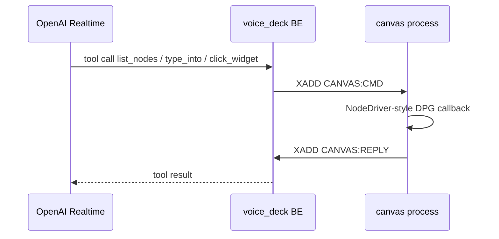

# Canvas

Voice tools operate the live MegaDesk canvas the same way the integration
harness does: list hosted nodes, select one, then type, click, or pick a
widget. Streams are defined once in
[`megadesk_contracts.wire.canvas`](../megadesk_contracts/wire/canvas.py).

The canvas process owns Dear PyGui. VoiceDeck publishes a verb and waits for
the matching `request_id` on `CANVAS:REPLY`. There is no consumer group: the
one live canvas `XREAD`s from the tail so a boot does not replay history.
That `XREAD` must omit `BLOCK`. Redis treats `BLOCK 0` as wait-forever, which
stalls the Dear PyGui render loop until the client socket times out.

## CANVAS:CMD

Stream, DB 0.

| Field | Meaning |
|---|---|
| `request_id` | Join key for the reply |
| `action` | `list_nodes`, `drop_node`, `select_node`, `list_widgets`, `get`, `click`, `type_into`, `select`, `check` |
| `node` | Catalog / chrome name, or a hosted `member_id` |
| `suffix` | Widget tag suffix under that node (`git_url`, `talk_btn`, …) |
| `value` | Text to type, combo value, or checkbox `true` / `false` |

`list_nodes` is the only action that may omit `node`. Widget verbs require
`suffix`. `select` requires `value`. `type_into` keeps interior whitespace.

## CANVAS:REPLY

Stream, DB 0. Plain `XREAD`, not a consumer group.

| Field | Meaning |
|---|---|
| `request_id` | Echoed from the command |
| `status` | `ok` or `error` |
| `result` | JSON body (`""` when there is nothing extra) |
