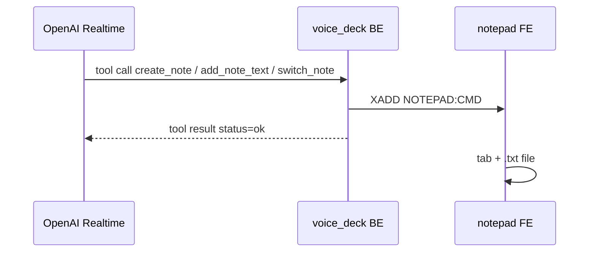

# Notepad

Voice tools write documents into a hosted notepad FE. The stream is defined
once in [`megadesk_contracts.wire.notepad`](../megadesk_contracts/wire/notepad.py).

## NOTEPAD:CMD

Stream, DB 0. Read with plain `XREAD`, not a consumer group: every hosted
notepad applies the same command. A pad that boots mid-session starts from the
stream tail so it does not replay history.

| Field | Meaning |
|---|---|
| `action` | `create`, `append`, or `switch` |
| `title` | Document name (required for `create` and `switch`) |
| `text` | Body for `append` (required); optional starting text on `create` |

`append` with an empty `title` writes to the pad's current target.

## Files

Notes are `{title}.txt` under `NOTEPAD_ROOT`, or `Nodes/Notepad/notes/`.
