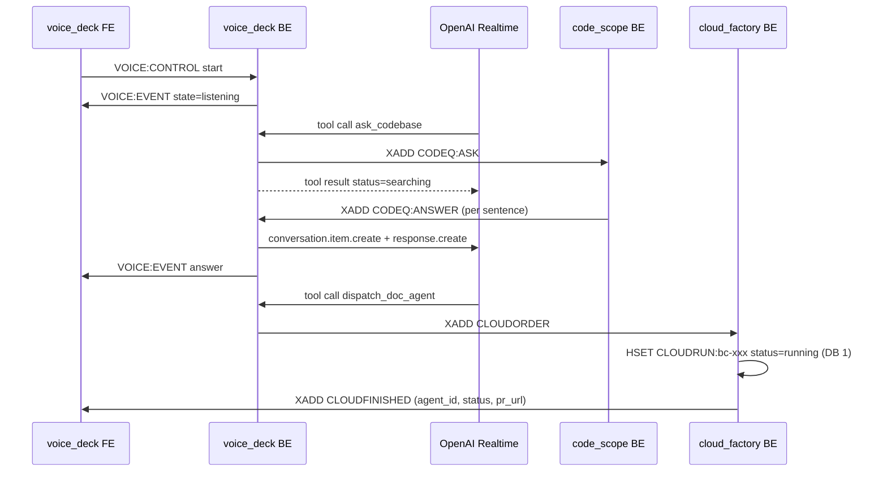

# Voice chain: CodeScope → VoiceDeck → CloudFactory

Three nodes, five streams, two hashes, each with exactly **one** definition in
[`megadesk_contracts/wire/`](../megadesk_contracts/wire/) — `code_scope.py`,
`voice.py`, `cloud.py` — imported by both halves of every node.

`CLOUDORDER` / `CLOUDFINISHED` / `CLOUDRUN` are also the cloud half of the Factory
contract, and deliberately mirror `WORKORDER` / `FINISHED` / `AGENTHANDLER` in
[machine-factory-pipeline.md](machine-factory-pipeline.md): both share the status
vocabulary in `wire/factory.py`. See
[`Nodes/Factory/README.md`](../../Nodes/Factory/README.md).

Streams use the process ephemeral DB (`REDIS_URL`, 0 on the live pair). The two hashes live on
the persistent half of that pair, because they have to outlive the stream traffic and the processes.

## CODEQ:ASK

Stream, DB 0. Consumer group `code_scope`.

| Field | Meaning |
|---|---|
| `session_id` | Which `CODESCOPE:SESSION:<id>` to ask against |
| `question_id` | Correlates every answer entry with its question |
| `repo` | Repo name, for display and routing |
| `question` | The question, self-contained |
| `mode` | `answer` or `propose_ticket` |

## CODEQ:ANSWER

Stream, DB 0. Read with plain `XREAD`, **not** a consumer group: the CodeScope FE and
VoiceDeck both read the same entries, and a group would let whichever asked first steal
them.

| Field | Meaning |
|---|---|
| `session_id`, `question_id`, `repo` | Echoed from the ask |
| `answer` | One sentence-ish chunk, published as the agent produces it |
| `final` | `"true"` on the last entry only, including when it is empty |
| `status` | `ok` or `error`; an error answer is always final |

## VOICE:CONTROL

Stream, DB 0. FE → BE, plain `XREAD` from the tail.

| Field | Values |
|---|---|
| `action` | `start`, `stop`, `mute`, `unmute`, `target` |
| `value` | Repo name for `target`, else `""` |

The BE reads from the stream's tail at boot, so a `start` published before it woke up is
ignored — a microphone that switches itself on from stream history is the worst failure
available to this node.

## VOICE:EVENT

Stream, DB 0. BE → FE.

| Field | Values |
|---|---|
| `kind` | `partial`, `final`, `answer`, `state`, `error`, `dispatch`, `target` |
| `text` | For `state`: one of `off`, `connecting`, `listening`, `thinking`, `speaking`, `muted`, `error` |
| `session_id` | The voice session that emitted it |

**Audio never appears on Redis.** Microphone frames and spoken output stay inside the BE,
for the same reason log line bodies stay off the Supervisor streams: the stream is a
control plane, and 24kHz PCM would swamp it.

## CLOUDORDER

Stream, DB 0. Consumer group `cloud_factory`.

| Field | Meaning |
|---|---|
| `order_id` | Minted by whoever ordered; survives the round trip |
| `repo_url` | The whole input — a cloud agent clones from GitHub itself |
| `ref` | Optional base ref; empty means `dev` |
| `title` | PR title, under ten words |
| `instructions` | What to change; the agent has no other context |
| `model` | Model id, or `auto` |
| `auto_pr` | `"true"` opens a PR when the work lands |

## CLOUDFINISHED

Stream, DB 0.

| Field | Meaning |
|---|---|
| `agent_id` | Cursor's `bc-` id; empty when no agent exists (`startup_error`, or `cancelled` before launch) |
| `order_id` | The order this settles |
| `status` | `finished`, `error`, `cancelled`, `startup_error` |
| `pr_url` | The pull request, when there is one |

`startup_error` means the run never started (fix auth or config, then retry); `error`
means it ran and failed (read the transcript). Collapsing the two loses the only
information that decides what to do next.

## Hashes (persistent DB)

| Key | Fields | Owner |
|---|---|---|
| `CODESCOPE:SESSION:<id>` | `repo`, `clone_path`, `agent_id`, `model`, `status` | CodeScope FE writes, BE updates `agent_id` / `status` |
| `CLOUDRUN:<agent_id>` | `order_id`, `repo_url`, `title`, `status`, `pr_url`, `run_id` | CloudFactory BE |

`agent_id` on a session is what lets a restarted CodeScope BE `Agent.resume` instead of
starting cold. `CLOUDRUN` is written before its order is acked, so a crash in between
leaves a visible run rather than an order that silently launched nothing — and its stored
status is what makes `CLOUDFINISHED` fire exactly once per run.

## Code references

- `MegaDesk-Contracts/megadesk_contracts/wire/{code_scope,voice,cloud,factory}.py` — the definitions
- `Nodes/CodeScope/CodeScopeManager/manager.py`, `Nodes/CodeScope/code_scope_frontend/app.py`
- `Nodes/VoiceDeck/VoiceDeckManager/session.py`, `Nodes/VoiceDeck/voice_deck_frontend/app.py`
- `Nodes/Factory/CloudFactory/CloudFactoryManager/{manager,runtime}.py`, `Nodes/Factory/CloudFactory/cloud_factory_frontend/app.py`
